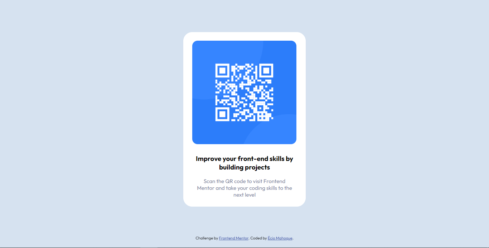

# Frontend Mentor - QR code component solution

This is a solution to the [QR code component challenge on Frontend Mentor](https://www.frontendmentor.io/challenges/qr-code-component-iux_sIO_H). Frontend Mentor challenges help you improve your coding skills by building realistic projects. 

## Table of contents

- [Overview](#overview)
  - [Screenshot](#screenshot)
- [My process](#my-process)
  - [Built with](#built-with)
  - [What I learned](#what-i-learned)
  - [Useful resources](#useful-resources)
- [Author](#author)

## Overview

### Screenshot

## My process

### Built with

- Semantic HTML5 markup
- CSS custom properties
- Flexbox

### What I learned

While working on this project, I encountered some difficulties working with flexbox, but I believe that for my first time, I have a basic understanding of how flexbox works

### Useful resources

- [Resource 1](https://css-tricks.com/snippets/css/a-guide-to-flexbox/) - This article helped me understand, a little, Flexbox display

## Author

- Name - Écio Mahoque

